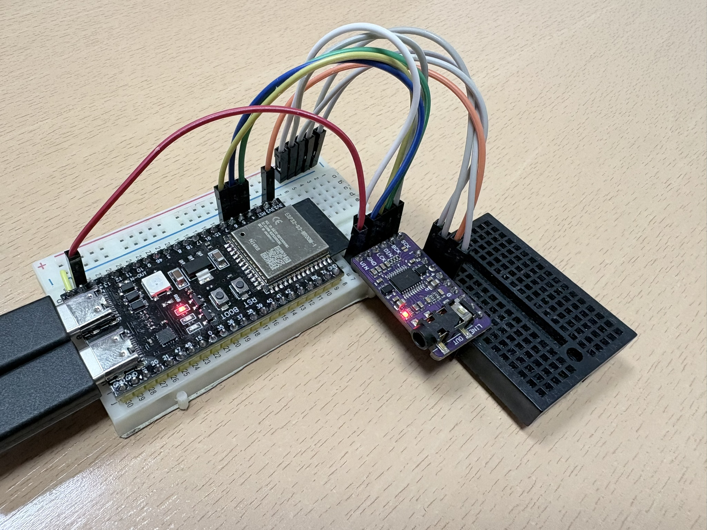

# esp32-s3-synth

A real-time FM synthesizer on an ESP32-S3 with dual-core architecture -- one core dedicated to audio rendering, the other to USB MIDI. Connect it to a PC via USB, send notes from a DAW or route a MIDI keyboard with `aconnect`, and get 9-voice polyphonic FM synthesis output through a PCM5102A DAC at 48 kHz. Uses [synth](https://github.com/jmaltar/synth) as a git submodule for the shared synthesis engine.

## Hardware

- **Board**: ESP32-S3-DevKitC (N16R8 -- 16 MB flash, 8 MB PSRAM)
- **CPU**: Dual-core Xtensa LX7 @ 240 MHz
- **Audio**: PCM5102A DAC via I2S0 standard mode, 48 kHz stereo 16-bit
- **MIDI**: USB OTG (TinyUSB device, appears as USB MIDI)
- **Debug**: UART0 @ 115200 baud (via built-in CH340 USB-to-UART chip)

### I2S wiring (to PCM5102A)



| ESP32-S3 pin | Function | PCM5102A pin |
|--------------|----------|--------------|
| GPIO4 | BCK | BCK |
| GPIO5 | LRCK | LCK |
| GPIO6 | DOUT | DIN |

PCM5102A configuration pins:

| PCM5102A pin | Connect to |
|--------------|------------|
| FMT | GND |
| SCL | GND |
| DMP | GND |
| FLT | GND |
| GND | GND |
| VCC | 5V |
| XMT | 3.3V |

### USB

Connect the ESP32-S3's USB OTG port to a computer. It enumerates as a USB MIDI device. Send notes from a DAW, or route a hardware MIDI keyboard through the PC with `aconnect`:

```bash
# list MIDI ports
aconnect -l

# route a MIDI keyboard (e.g. client 24) to the synth (e.g. client 28)
aconnect 24:0 28:0
```

Note: the debug UART (CH340) and USB MIDI (OTG) use separate USB connectors on the DevKit.

### UART debug

Connect to the CH340 USB port (not the OTG port) to see boot messages and debug output. Baud rate: 115200 8N1.

## How it works

The firmware uses both ESP32-S3 cores with FreeRTOS:

| Core | Task | Priority | Stack |
|------|------|----------|-------|
| Core 1 | Audio (synth + I2S write) | 10 | 32 KB |
| Core 0 | USB/MIDI (TinyUSB poll) | 5 | 4 KB |

On boot, the audio task initializes the synth engine and starts the I2S peripheral. The USB/MIDI task initializes TinyUSB and polls for incoming MIDI packets.

MIDI events flow between cores via a FreeRTOS queue (32 events max). The USB task decodes note on/off messages and enqueues them. The audio task drains the queue at the start of each block, then renders 16 mono samples (64 stereo int16 values) and writes them to I2S.

## Toolchain

- ESP-IDF (Espressif IoT Development Framework)
- Follow the [ESP-IDF setup guide](https://docs.espressif.com/projects/esp-idf/en/latest/esp32s3/get-started/)

## Build

Clone with submodules:

```bash
git clone --recurse-submodules https://github.com/jmaltar/esp32-s3-synth.git
```

Set target and build:

```bash
idf.py set-target esp32s3
idf.py build
```

VS Code tasks: **Build**, **Clean**.

## Flash

```bash
idf.py flash -p /dev/ttyUSB0
```

VS Code tasks: **Flash**, **Flash & Monitor**.

## Monitor

```bash
idf.py monitor -p /dev/ttyUSB0
```

VS Code tasks: **Monitor**.

## Configuration

- `SYNTH_N_VOICES=9` -- 9 voices of FM synthesis (set in main/CMakeLists.txt)
- CPU clock: 240 MHz
- FreeRTOS tick rate: 1000 Hz (for USB timing)
